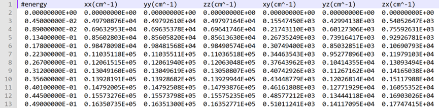

# SLME（Spectroscopic Limited Maximum Efficiency）程序是根据材料的吸收谱计算太阳能电池在不同厚度下的光谱限制最大效率。

## 第一步：计算吸收光谱

1.复制使用pbe泛函计算的dos文件夹为op

```python
cp dos op
```

放入job.sh，修改incar，增加参数LOPTICS = .T.，并打开hse06命令行提交vasp计算。

2.计算完成后，使用VASPKIT对光学计算结果进行后处理得到ABSORPTION.dat文件

va—71—710（二维材料）—1 （选eV为能量单位）

va—71—711（块体材料）—1 （选eV为能量单位）



（第一列为能量，第二至四列为xyz三个方向的吸收系数，选取两列数据可做光吸收谱图）。

## 第二步：计算slme

1. 将SL3ME.py、am1.5G.dat传至op文件夹下，修改88和89行的直接带隙与间接带隙值及90行的文件名称。带隙值同样选取hse06泛函计算结果，当材料为直接带隙半导体时，material_direct_allowed_gap = material_indirect_gap。


2. ```python
   python SL3ME.py
   ```

   


