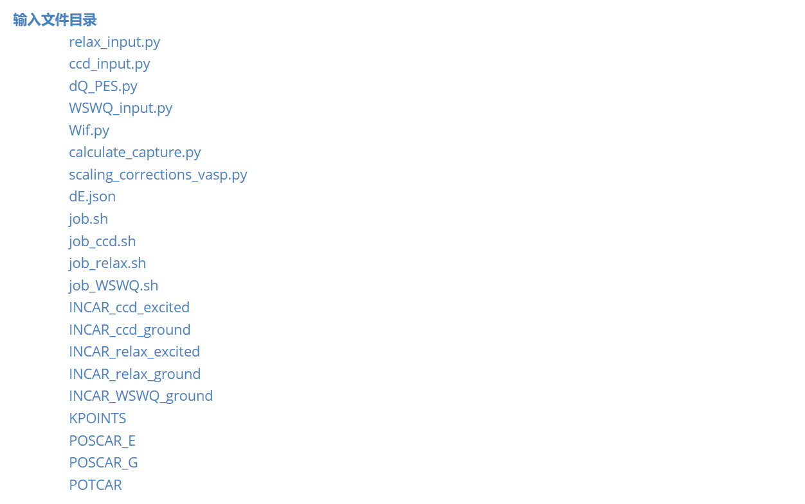
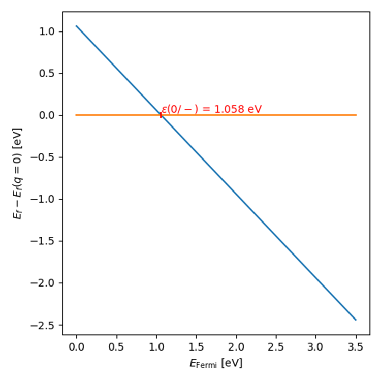
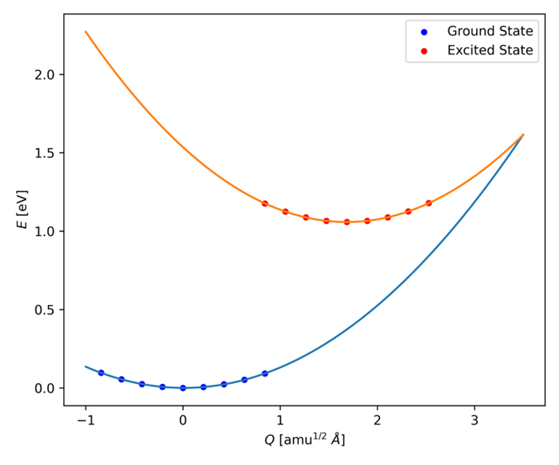
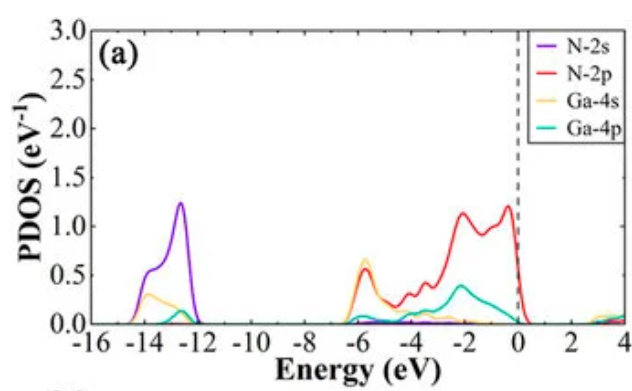
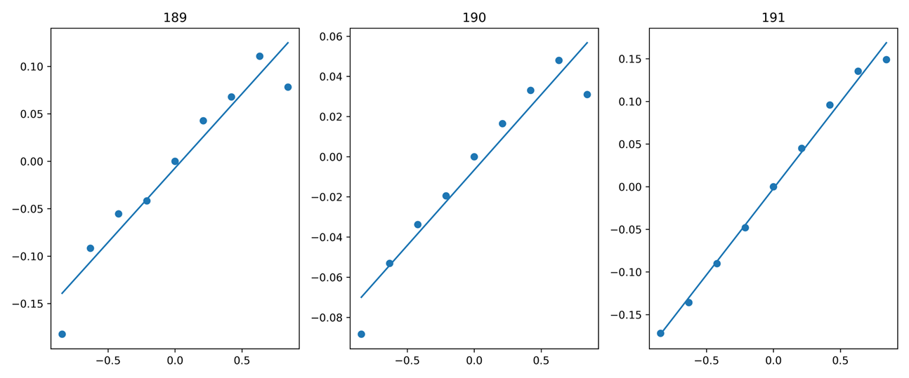
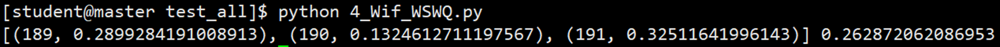

# [NONRAD](https://github.com/mturiansky/nonrad)计算非辐射俘获系数（Cn/Cp）

## 一、[理论基础](https://journals.aps.org/prb/abstract/10.1103/PhysRevB.90.075202)

空穴非辐射俘获系数的计算公式如下：
$$
C_p=\sqrt{\frac{2\pi}{\hbar}}\,gW_{if}^2
\sum_m w_m
\sum_n
\left|
\left\langle \xi_{im}\middle|Q-Q_0\middle|\xi_{fn}\right\rangle
\right|^2
\delta(\Delta E+m\hbar\Omega_i-n\hbar\Omega_f)
$$
单位：
$$
cm^3 s^{-1}
$$


## 二、[计算流程](https://nonrad.readthedocs.io/en/latest/tutorial.html)：

### 1、基于第一性原理的缺陷计算

### 2、位形坐标图(CCD)计算

### 3、电子-声子耦合计算

### 4、非辐射俘获系数计算



## 三、例子：GaN

纤锌矿型 GaN 中 N 位点上带负电荷的 C 取代对空穴的俘获，包含0和-1两个电荷态。
$$
charge state -1 + h^+ = charge state 0
$$

$$
VBM - e^- →defect_{empty}
$$

#### 1、第一性原理的缺陷计算

获得缺陷的平衡结构和跃迁能级(dE)，修改dE.json中dE的数值。

```json
dE=1.058 eV
```



#### 2、ccd计算

1. 初态末态进行结构弛豫，复制0和-1态的CONTCAR和POTCAR到work_dir下，将CONTCAR命名为POSCAR_G和POSCAR_E分别进行结构弛豫relax。

2. 准备一系列原子结构模型，其位移在两种缺陷构型之间插值（`displacements = np.linspace(-0.5, 0.5, 9)`）插9个点同时不移除0位移结构。对这些结构进行单点能计算，并提取总能量。

3. 找到变形结构能量计算的最佳拟合，以生成势能面（PES）。求解每个势能面的一维薛定谔方程，以获得其声子（核）波函数。

   ```json
   {
       "dQ": 1.6858758484088996,
       "ground_omega": 0.033289304485203994,
       "excited_omega": 0.03753389929662619
   }
   ```



#### 3、计算电子-声子耦合矩阵元，

构建构型坐标来计算每个势能面之间的波函数重叠，得到电声耦合强度Wif。

```python
#INCAR
ISPIN = 2
NUPDOWN = 1
#Wif.py
Wifs = get_Wif_from_WSWQ(WSWQs, str(gpythonround_files / 'vasprun.xml'), 192, [189, 190, 191], spin=1, fig=fig)
```

基态电荷数383，`ISPIN = 2`表示开启自旋，`NUPDOWN = 1`代表磁矩为1，则spin up的电子数（192）比spin down（191）的多一个，说明192为单电子占据缺陷态，spin down为空缺陷态。价带上电子容易跳的空缺陷态上被俘获，因此`spin=1`。GaN的VBM主要N-2p轨道做主要贡献，于是选择3条简并轨道共同反映VBM(189、190、191)。



```python
 spin component 1
 k-point     1 :       0.2500    0.2500    0.2500
  band No.  band energies     occupation 
    189       1.4516      1.00000
    190       1.5808      1.00000
    191       1.7476      1.00000
    192       1.7953      1.00000
    193       6.4914      0.00000
 spin component 2
 k-point     1 :       0.2500    0.2500    0.2500
  band No.  band energies     occupation 
    189       1.6466      1.00000
    190       1.7347      1.00000
    191       1.8800      1.00000
    192       3.4944      0.00000
    193       6.5026      0.00000
```






###### [注意：VASP 5.4.4 版本计算电声耦合时存在Bug](https://github.com/mturiansky/nonrad/issues/2#issuecomment-1084963299)

1、使用VASP 6.0以上版本，该版本已修复Bug。

2、修复5.4.4版本

```python
#./src/elphon.F
      ALLOCATE(COVL(NB_TOT,NB_TOT))
      COVL = 0#这一行移动到kpoint: DO NK=1,W%WDES%NKPTS后面

      CALL SETWDES(W%WDES,WDES1,0)

      CALL NEWWAVA_PROJ(WOVL,WDES1)

      ! Generate output file
      IF (IO%IU0 >= 0) THEN
         OPEN(UNIT = 1447, FILE = 'WSWQ', STATUS = 'REPLACE')
      ENDIF

      spin: DO ISP=1,W%WDES%ISPIN
      kpoint: DO NK=1,W%WDES%NKPTS
```

#### 4、计算缩放系数

$$
Cp_{corrected} = f * Cp_{supercell}
$$

此处电子-声子矩阵元是在中性电荷态下计算的，无需考虑缩放系数，我们以激发态为例。当载流子被非零电荷态（q=-1）的缺陷俘获时，就会发生**库仑相互作用**。其次，由于周期性边界条件的限制，小超晶胞会导致**伪电荷相互作用**，缺陷与离域能带边缘之间会产生相互作用。这两种作用都会影响电子-声子矩阵元，进而影响非辐射俘获系数的计算结果。

##### 4.1 sommerfeld parameter（索末菲参数）

$$
定义：Z=q_d/q_c(其中q_d是电荷态带电量，q_c是载流子带电量)
$$

电荷态带电量为-1，空穴带电量为+1,则Z=-1/1=-1。

```python
Z = -1
m_eff = 0.18 # hole effective mass of GaN
eps_0 = 8.9  # static dielectric constant of GaN
print(f'Sommerfeld Parameter @ 300K: {sommerfeld_parameter(300, Z, m_eff, eps_0):7.05f}')
T = np.linspace(25, 800, 1000)
f = sommerfeld_parameter(T, Z, m_eff, eps_0)
```

```python
Sommerfeld Parameter @ 300K: 7.77969
```

###### **300K 分析**：

1、带电电荷态要比不带电计算得到的非辐射俘获系数放大了约7.8倍。

2、两者电荷类型相反，长程库仑引力在空间中形成了一个“漏斗”，将远处的载流子吸引向缺陷中心，显著提高了捕获概率（同种电荷相斥，Sommerfeld Parameter会小于1）；

3、300K时热运动不足以摆脱引力束缚，不可以忽略库仑吸引势。该缺陷是一个高效的“复合中心“，会严重降低器件效率。


###### **S (T)分析**：

1、库仑引力全程占主导，0-800K范围内全部远大于1；

2、低温区（< 100 K），载流子的平均热运动动能极低；它们在通过缺陷附近时，极易被缺陷的库仑电场“捕捉”并吸入势阱。因此，低温下的非辐射复合系数被放大了数十倍；

3、室温区（~ 300 K）：平缓过渡点，此时热激发与库仑引力处于抗衡状态，库仑增强效应让复合速率维持在一个相当高的水平（放大近 8 倍）；

4、高温区（> 400 K）：载流子的热运动速度越快，高动能使得载流子能够轻易“冲刷”过缺陷的库仑势垒而不被捕获（即热退耦效应）。因此，温度越高，库仑引力的放大效应越弱，索末菲因子逐渐向 1 靠拢。

##### 4.2 带电超胞效应

比例系数的计算方法是将电荷密度的径向分布与纯粹的均匀分布进行比较。

```python
factor = charged_supercell_scaling(wavecar_path, 189, def_index=192, fig=fig)#190、191不存在平台值
print('scaling =', 1 / factor)
```


```python
scaling = 0.917431192661
```

###### VBM分析

1、左图是累积电荷密度：红线理论拟合的有效质量模型波函数，蓝线是DFT 实际计算得到的波函数累计电荷，红色区域是误差范围，拟合良好。说明scaling correction是可信的、缺陷态没有严重局域化、有效质量近似可用；

2、中间图片显示了使两者吻合的标度参数。即DFT 波函数与理论散射态波函数的比值，在2-3Å附近发现了一个平台值α=1时完全不需要修正，此时α≈1.1，说明缺陷附近有一定局域化增强，因此俘获系数需要乘0.917431192661的校正。

3、右图是缩放系数的导数，它提供了一种寻找平台点的算法方法；横线之下对应的横坐标代表是平台。

4、两个平台区域：C_N缺陷有明显局域 p 态，同时又耦合价带尾态；有限尺寸周期镜像开始影响波函数，α 会重新变化。


```python
scaling = 1.4492753623188408
```

###### CBM分析：

1、左图：拟合良好，但较VBM偏差较大

2、α≈0.7，说明缺陷附近有一定局域化减弱，因此俘获系数需要乘以11.4492753623188408的校正。

3、1.7-2.5区域存在平台值。

#### 5、空穴俘获系数和俘获面积的计算及可视化

```python
from nonrad import get_C
dE
dQ
wi
wf
Wif
volume
g=4 #构型简并度。对于碳原子取代，空穴可以被捕获到4种相同的缺陷构型中(每个键上各一种)
```


```python
Temperature : 299.62 K
Thermal velocity v_th : 2.535e+07 cm/s
Capture coefficient C : 7.852e-10 cm^3 s^-1
Capture cross section sigma : 3.098e-17 cm^2
```

